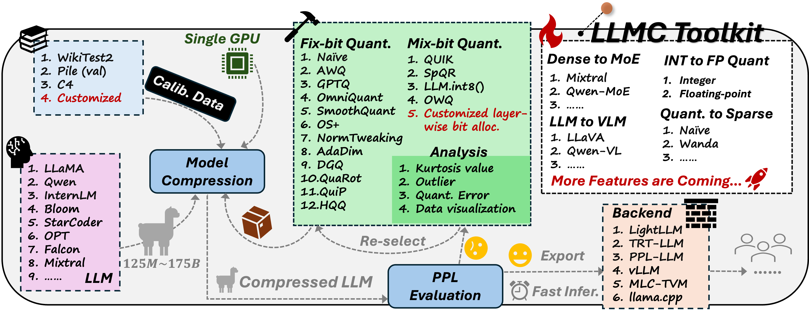

# llmc：向精确高效的大型语言模型压缩迈进



**\[ [English](https://github.com/ModelTC/llmc?tab=readme-ov-file#llmc-towards-accurate-and-efficient-llm-compression) | 中文 | [日本語](README_ja.md) \]**

**llmc** 是一个即插即用的工具，旨在通过最先进的压缩算法进行大型语言模型的压缩，以提高效率并减小模型大小，同时不牺牲性能。

**文档**在[这里](https://llmc-test.readthedocs.io/en/latest/).


## 突出特性

- 量化大型语言模型，如 Llama2-70B、OPT-175B，并在仅一个 A100/H100/H800 GPU上评估其 PPL💥。
- 为用户提供选择的最新的[与原论文代码仓库精度对齐](benchmark/align.md)的压缩算法，并且用户可以在一个大型语言模型上依次使用多个算法💥。
- 由我们工具通过特定压缩算法导出的转换模型（`save_trans`模式在`quant`部分的[配置](#配置)）可以通过多个后端进行简单量化，得到经过特定压缩算法优化的模型，相应的后端可以进行推断💥。
- 我们的压缩模型（`save_lightllm`模式在`quant`部分的\[配置\](#配置)）具有较低的内存占用，可以直接通过[Lightllm](https://github.com/ModelTC/lightllm)进行推断💥。

## 使用方式

1. 克隆此仓库并安装包：

   ```shell
   # 安装包
   cd llmc
   pip install -r requirements.txt
   ```

2. 准备模型和数据。

   ```shell
   # 在从huggingface下载LLM后，按以下方式准备校准和评估数据：
   cd tools
   python download_calib_dataset.py --save_path [校准数据路径]
   python download_eval_dataset.py --save_path [评估数据路径]
   ```

3. 选择一个算法来量化你的模型：

   ```shell
   # 这是一个关于 Awq 的例子：
   cd scripts
   # 修改 bash 文件中的 llmc 路径，``llmc_path``。你也可以选择``llmc/configs/quantization/Awq/``中的一个配置来量化你的模型，或者通过更改``--config``参数在 run_awq_llama.sh 中使用我们提供的配置。
   bash run_awq_llama.sh
   ```

## 配置

为了帮助用户设计他们的配置，我们现在解释我们在`llmc/configs/`下提供的所有配置中的一些通用配置：

- `model`:

  ```yaml
  model:
      # 用``llmc/models/*.py``中的类名替换。
      type: Llama
      # 用你的模型路径替换。
      path: model path
      torch_dtype: auto
  ```

- `calib`:

  ```yaml
  # 注意：一些算法不需要``calib``，如 naive... 所以，你可以移除这部分。
  calib:
      # 用之前下载的校准数据名称替换，例如，pileval、c4、wikitext2 或 ptb。
      name: pileval
      download: False
      # 用之前下载的某个校准数据的路径替换，例如，pileval、c4、wikitext2 或 ptb。
      path: calib data path
      n_samples: 128
      bs: -1
      seq_len: 512
      # 用``llmc/data/dataset/specified_preproc.py``中的函数名称替换。
      preproc: general
      seed: *seed
  ```

- `eval`:

  ```yaml
  # 如果你想评估你的预训练/转换/假量化模型的 PPL。
  eval:
      # 你可以评估预训练、转换、假量化模型，并设置你想要评估的位置。
      eval_pos: [pretrain, transformed, fake_quant]
      # 用之前下载的评估数据的名称替换，例如，c4、wikitext2、ptb 或 [c4, wikitext2]。
      name: wikitext2
      download: False
      path: eval data path
      # 对于 70B 模型评估，bs 可以设置为 20，并且可以将 inference_per_block 设置为 True。
      # 对于 7B / 13B 模型评估，bs 可以设置为 1，并且可以将 inference_per_block 设置为 False。
      bs: 1
      inference_per_block: False
      seq_len: 2048
  ```

- `save`:

  ```yaml
  save:
      # 如果``save_trans``为 True，这意味着你想要导出转换模型，例如，参数修改的模型，其性能和结构与原始模型相同，用户可以对转换模型进行简单量化，以获得与特定算法量化模型相同的性能。
      save_trans: False
      # 如果``save_lightllm`` 或者 ``save_trtllm`` 为 True，这意味着你想要导出真实的量化模型，例如，低位权重和权重及激活量化参数。
      save_lightllm: False
      # 如果``save_fake``为 True，意味着你想要导出假量化模型，例如，去量化的权重和激活量化参数。
      save_fake: False
      save_path: ./save

  ```

- `quant`:

  ```yaml
  quant:
      # 用``llmc/compression/quantization/*.py``中的类名替换。
      method: OmniQuant
      # 仅权重量化没有``act``部分。
      weight:
          bit: 8
          symmetric: True
          # 量化粒度：per_channel, per_tensor, per_head（不推荐）。
          granularity: per_channel
          group_size: -1
          # 校准算法：learnble, mse, 以及 minmax（默认）。
          calib_algo: learnable
          # 使用直通估计（Stright-Through Estimation），这对于可学习的校准算法是必需的。
          ste: True
      act:
          bit: 8
          symmetric: True
          # 量化粒度：per_token, per_tensor
          granularity: per_token
          ste: True
          # 静态量化（校准期间的量化）或动态量化（推理期间的量化）。
          static: True
      # 这部分是为特定算法设计的，用户可以参考我们提供的算法来设计他们自己的算法。
      special:
          let: True
          lwc_lr: 0.01
          let_lr: 0.005
          use_shift: False
          alpha: 0.5
          deactive_amp: True
          epochs: 20
          wd: 0
      # 如果 quant_out 为 True，使用前一个量化块的输出作为后续块的校准数据。
      quant_out: True

  ```

## 支持的模型列表

✅ [BLOOM](https://huggingface.co/bigscience/bloom)

✅ [LLaMA](https://github.com/facebookresearch/llama)

✅ [LLaMA V2](https://huggingface.co/meta-llama)

✅ [StarCoder](https://github.com/bigcode-project/starcoder)

✅ [OPT](https://huggingface.co/docs/transformers/model_doc/opt)

✅ [Falcon](https://huggingface.co/docs/transformers/model_doc/falcon)

✅ [InternLM2](https://huggingface.co/internlm)

✅ [Mistral](https://huggingface.co/docs/transformers/model_doc/mistral)

✅ [LLaMA V3](https://huggingface.co/meta-llama)

✅ [Mixtral](https://huggingface.co/docs/transformers/model_doc/mixtral)

✅ [Qwen V2](https://github.com/QwenLM/Qwen2)

✅ [LLaVA](https://github.com/haotian-liu/LLaVA)

✅ [InternLM2.5](https://huggingface.co/internlm)

✅ [StableLM](https://github.com/Stability-AI/StableLM)

✅ [Gemma2](https://huggingface.co/docs/transformers/main/en/model_doc/gemma2)

✅ [Phi2](https://huggingface.co/microsoft/phi-2)

✅ [Phi 1.5](https://huggingface.co/microsoft/phi-1_5)

✅ [MiniCPM](https://github.com/OpenBMB/MiniCPM)

✅ [SmolLM](https://huggingface.co/collections/HuggingFaceTB/smollm-6695016cad7167254ce15966)

你可以参考 `llmc/models/*.py` 下的文件添加你自己的模型类型。

## 支持的算法列表

### 量化

✅ Naive

✅ [AWQ](https://arxiv.org/abs/2306.00978)

✅ [GPTQ](https://arxiv.org/abs/2210.17323)

✅ [SmoothQuant](https://arxiv.org/abs/2211.10438)

✅ [OS+](https://arxiv.org/abs/2304.09145)

✅ [OmniQuant](https://arxiv.org/abs/2308.13137)

✅ [NormTweaking](https://arxiv.org/abs/2309.02784)

✅ [AdaDim](https://arxiv.org/pdf/2309.15531.pdf)

✅ [QUIK](https://arxiv.org/abs/2310.09259)

✅ [SpQR](https://arxiv.org/abs/2306.03078)

✅ [DGQ](https://arxiv.org/abs/2310.04836)

✅ [OWQ](https://arxiv.org/abs/2306.02272)

✅ [LLM.int8()](https://arxiv.org/abs/2208.07339)

✅ [HQQ](https://mobiusml.github.io/hqq_blog/)

✅ [QuaRot](https://arxiv.org/abs/2404.00456)

### 剪枝

✅ Naive(Magnitude)

✅ [Wanda](https://arxiv.org/abs/2306.11695)

✅ [ShortGPT](https://arxiv.org/abs/2403.03853)

## 致谢

我们的代码参考了以下仓库：

- https://github.com/mit-han-lab/llm-awq
- https://github.com/mit-han-lab/smoothquant
- https://github.com/OpenGVLab/OmniQuant
- https://github.com/IST-DASLab/gptq
- https://github.com/ModelTC/Outlier_Suppression_Plus
- https://github.com/IST-DASLab/QUIK
- https://github.com/Vahe1994/SpQR
- https://github.com/ilur98/DGQ
- https://github.com/xvyaward/owq
- https://github.com/TimDettmers/bitsandbytes
- https://github.com/mobiusml/hqq
- [https://github.com/locuslab/wanda](https://github.com/locuslab/wanda)
- [https://github.com/EleutherAI/lm-evaluation-harness](https://github.com/EleutherAI/lm-evaluation-harness)

